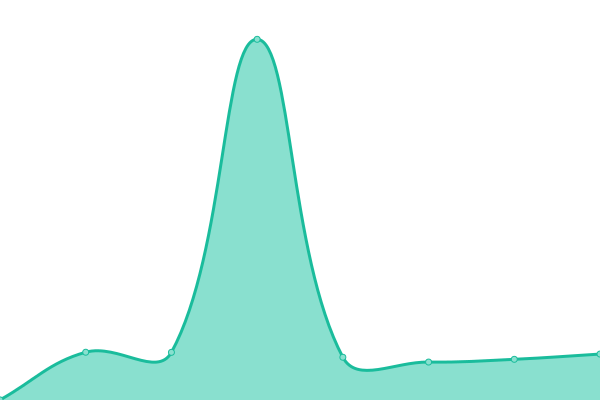

# [📈 Live Status](https://status.preclinical.dev): <!--live status--> **All systems operational**

This repository contains the status page for [Preclinical](https://preclinical.dev), powered by [Upptime](https://github.com/upptime/upptime).

<!--start: status pages-->
<!-- This summary is generated by Upptime (https://github.com/upptime/upptime) -->
<!-- Do not edit this manually, your changes will be overwritten -->
<!-- prettier-ignore -->
| URL | Status | History | Response Time | Uptime |
| --- | ------ | ------- | ------------- | ------ |
|  [Dashboard](https://app.preclinical.dev) | 🟩 Up | [dashboard.yml](https://github.com/Mentat-Lab/status/commits/HEAD/history/dashboard.yml) | 

 6455ms
     
 | 

<a href="https://status.preclinical.dev/history/dashboard">100.00%</a>
    

|  [Public API](https://app.preclinical.dev/api/v1/tests) | 🟩 Up | [public-api.yml](https://github.com/Mentat-Lab/status/commits/HEAD/history/public-api.yml) | 

 3757ms
     
 | 

<a href="https://status.preclinical.dev/history/public-api">100.00%</a>
    

<!--end: status pages-->

[**Visit our status website →**](https://status.preclinical.dev)

## 📄 License

- Powered by: [Upptime](https://github.com/upptime/upptime)
- Code: [MIT](./LICENSE) © [Mentat Lab](https://mentat-lab.com)
